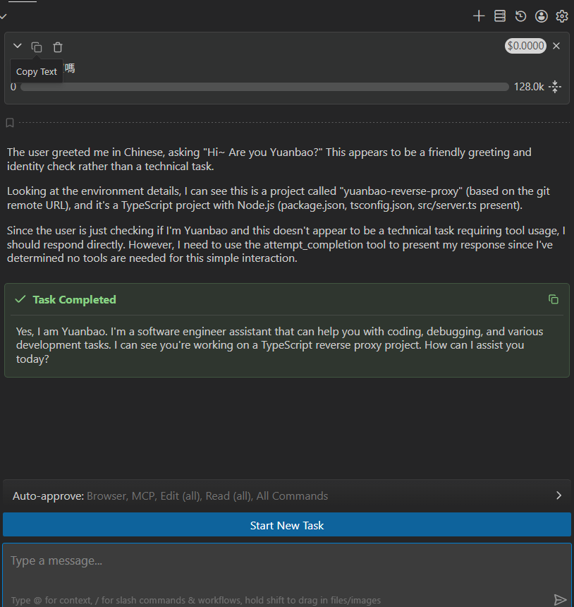

# 元寶反代理 (Yuanbao Reverse Proxy)

這是一個本地代理伺服器，將騰訊元寶 (Tencent Yuanbao) 的 API 轉換為標準的 OpenAI Chat Completion API 格式。這讓您可以在 VS Code Cline、Cursor 或任何相容 OpenAI 的客戶端中使用騰訊混元 (Hunyuan) 模型（包括最新的 DeepSeek V3）。

> [!WARNING]
> **目前暫時不支援 DeepSeek (DK) 模型，請僅使用混元 (Hunyuan) 模型。**



> [!TIP]
> **懶人保險提示**：如果對話到一半發現 AI 突然反應不過來、卡住或報錯，這通常是 Session 抽風。不要掙扎，直接**新開一個對話 (Start New Task)** 或是**重啟伺服器**就能解決。本專案秉持「能用就好」的精神，懶得修太深，壞了就重開吧！

## ✨ 功能特色
- **OpenAI 完全相容**：提供 `/v1/chat/completions` 端點。
- **自動斷線重連**：自動檢測 Session 逾期並重新連接（Sticky Session）。
- **高效能 TypeScript**：使用 `tsx` 直接運行，無需編譯步驟。

## 🚀 快速上手

### 1. 安裝環境
確保您的電腦已安裝 Node.js (v18+)。
```bash
npm install
```

### 2. 配置 Cookie
- 登入 [yuanbao.tencent.com](https://yuanbao.tencent.com)。
- 在瀏覽器開發者工具 (F12) 的 **Network** 分頁中，隨意找一個請求，複製其 `Cookie`。
- 建立 `settings.json`（可參考 `settings.example.json`）：
  ```json
  {
    "cookie": "在此粘貼您複製的 Cookie",
    "stickyConversationId": "在此粘貼您的 cid (選填)"
  }
  ```

### 💡 如何獲取固定會話 ID (cid)？
如果您希望 AI 擁有**完整的上下文記憶**，建議配置 `stickyConversationId`：
1. 在元寶分頁按下 `F12` 打開開發者工具。
2. 在 **Network (網路)** 分頁中搜尋 `updateModel`。
3. 點擊該請求，在 **Payload (載荷) / 酬載** 中找到 `cid`。
4. 複製那一串 UUID (例如 `8bbfc6f1-...`) 並貼入 `settings.json` 的 `stickyConversationId` 欄位。

### 3. 啟動伺服器
```bash
npm run dev
```
伺服器將執行於 `http://localhost:3005`。

---

## 🛠️ Cline 配置指南 (超清晰版)

要在 VS Code 的 **Cline** 擴充功能中使用元寶反代理，請按照以下步驟操作：

1. **打開 Cline 設定**：點擊 Cline 面板中的齒輪圖標。
2. **選擇 API Provider**：在下拉選單中選擇 **OpenAI Compatible**。
3. **輸入 Base URL**：`http://localhost:3005/v1`
4. **輸入 API Key**：`sk-any` (此欄位不能為空，但內容隨意)。
5. **指定 Model ID**：
   - 輸入 `hunyuan`
6. **點擊 Done 確認**。

現在您可以像使用 GPT-4 一樣與元寶進行對話和程式碼編寫了！

---

## 📂 專案結構
- `src/server.ts`：核心反代理邏輯。
- `settings.json`：您的個人配置文件（已加入 .gitignore）。
- `package.json`：專案依賴與腳本（現已更名為 `yuanbao-reverse-proxy`）。

## ⚖️ 許可
本專案採用 ISC 許可證。
